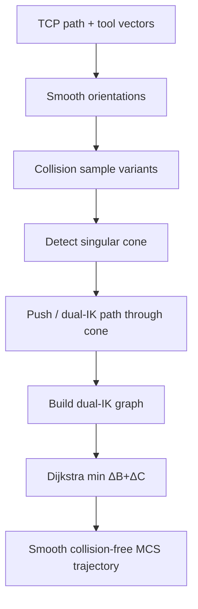

# #49 — Singularity-aware motion planning (2021)

- **Family:** D
- **Link:** doi.org/10.1109/LRA.2021.3091109
- **Source:** compendium `paper-01.pdf` / `held-papers.json`

## When to use (adaptive slicer product)
- Downstream of B/C/E curved or multi-directional toolpaths on a **5-axis Cartesian** printer (table-table, head-head, or head-table) when tool vectors pass near the rotary singular cone (near-vertical nozzle / zero tilt).
- Extrusion quality fails in singular regions: over-/under-extrusion, C-axis whip, seam breaks — Part F pitfall: pole singularity at zero tilt and C-axis wrap.
- You need collision-aware orientation edits **and** dual-IK selection before TOPP-RA time parameterization; not for pure 3-axis A skins.

## Core idea (one sentence)
Push waypoint orientations out of (or carefully through) the rotary singular cone, then pick dual-IK samples via Dijkstra so B/C angle change stays small enough that tip speed stays inside the extruder’s feasible band.

## Algorithm (plain steps)
1. Take a curved-layer toolpath as waypoints \(\mathbf{x}=[\mathbf{p},\mathbf{n}]\) in workpiece coordinates (from B/C/E).
2. Optionally Laplacian-smooth orientations; detect collisions by transforming a convex printer-head hull and flag collided segments.
3. For collided waypoints, sample \(k\) orientation variants within a cone around \(\mathbf{n}\) (e.g. \(\beta\leq 45^\circ\)); keep only collision-free samples.
4. Detect singular-region waypoints (\(\sqrt{(n_x/n_z)^2+(n_y/n_z)^2}\leq\tan\alpha\), e.g. \(\alpha\approx 4.5^\circ\)).
5. For each singular segment with anchors \(\mathbf{x}_s,\mathbf{x}_e\): if \(|\Delta C|\leq\pi/2\), project waypoints onto the singular-cone boundary arc; else use the dual IK of the exit anchor (\(B'=-B\), \(C'=C+\pi\)) and interpolate a lower-\(\Delta C\) path through the cone.
6. Re-check collision on singularity-edited poses; generate small local variants if needed.
7. Build a layered graph: each waypoint → up to \(2k\) MCS nodes (two IK solutions × variants); edge weight \(=|\Delta B|+|\Delta C|\); drop edges whose swept head hull collides.
8. Dijkstra shortest path minimizing total B/C variation; recover XYZ from the chosen IK (Table of TRT / head-head / head-table formulas).
9. Emit joint or TCP machine code; pair with TOPP-RA so tip speed \(\in[v_{\min},v_{\max}]\) from extruder limits; E follows tip speed, not axis speed.

## Constraints / what to expect
- Targets **parallel 5-axis** (3 linear + 2 rotary), not free 6-DoF arms (use FRIK #64 for those).
- Continuity of extrusion is mandatory — milling-style retract/reposition through singularity is not allowed.
- Both max **and min** tip speed matter; singular C-axis spikes can force tip speed below \(v_{\min}\) → over-extrusion then hysteresis under-extrusion.
- Extreme singular segments may still need a toolpath break (rare).
- C-axis cable/filament wrap limits on some head-head configs are future work in the paper — check machine travel.
- Part F: two IK solutions, pole singularity at zero tilt, C-axis wrap, nonlinear motion without TCP.

## Data in
- Ordered waypoints: position + preferred tool vector from B/C/E (or A on Triple-Z with rotary).
- Machine kinematic type + rotation-center / nozzle-length calibration; singular angle \(\alpha\); extruder \([f_{\min},f_{\max}]\); head convex hull; already-printed geometry for collision.

## Data out
- Per-waypoint MCS joints `[X,Y,Z,B,C]` (or A/C) with chosen IK branch; collision report; tip-speed feasibility histogram.
- Machine code (G-code with TCP if available, else joint); ready for TOPP-RA timing.

## Argument → proof sketch → conclusion
**Argument.** Near-vertical tool vectors map through \(\mathrm{atan2}\) into large discontinuous C-axis jumps; motors cannot keep tip speed above the extruder minimum, so bead quality collapses even if WCS waypoints are smooth.
**Proof sketch.** Segment singular regions; project or dual-IK-interpolate orientations so neighboring \(|\Delta C|\) is bounded; encode dual IK + collision-free orientation samples as a layered graph; Dijkstra minimizes \(\sum(|\Delta B|+|\Delta C|)\); tip-speed histograms on six models drop out-of-band waypoints from ~7–18% to ~0–3%.
**Conclusion.** Integrated singularity + collision orientation planning is a required post-slice stage for 5-axis MAAM before time parameterization and extrusion sync.

## Chaining
- Before: B curved layers (#16/#66/#42/#45/…), C multi-directional / conformal (#43/#33/#1), E spatial fiber (#10/#52) — always take TCP + tool vector from upstream.
- After: TOPP-RA-class time parameterization; TCP emission (G43.4/G43.5, TRAORI, LinuxCNC xyzac-trt/xyzbc-trt, Marlin2ForPipetBot); optional FRIK (#64) if handing off to a 6-DoF arm cell.
- Do not chain with: pure 3-axis A pipelines that never tilt; indexed stop-and-rotate GRBL (#38) when continuous simultaneous 5-axis is required; offline A*/RRT environment structure generators (#63) as a substitute for singularity IK.

## Notes / inventory flags
- IEEE RAL 2021; arXiv 2103.00273; code: `github.com/zhangty019/MultiAxis_3DP_MotionPlanning`.
- Supports fabrication enabling for Fang Reinforced FDM / related curved-layer papers.
- Software anchors (family D): Marlin2ForPipetBot; LinuxCNC xyzac-trt / xyzbc-trt; TOPP-RA.
