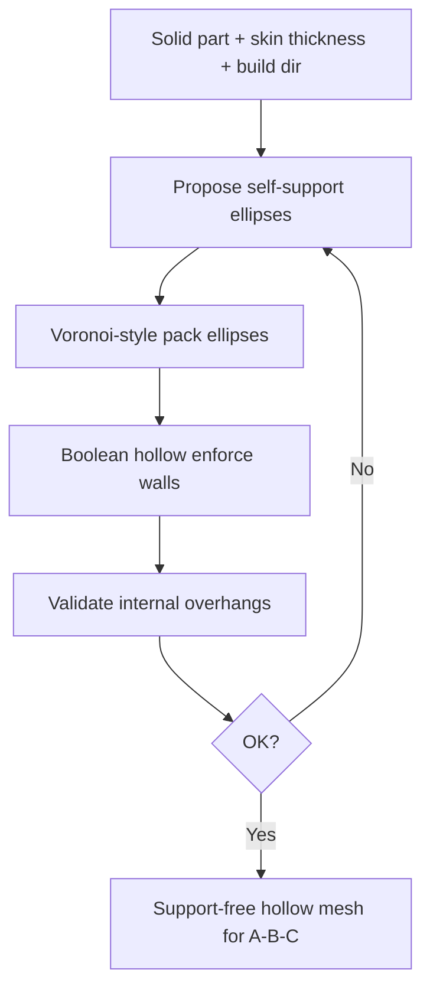

# #50 — Support-free hollowing via Voronoi of ellipses (2017)

- **Family:** G (topology / DfAM)
- **Link:** arxiv.org/abs/1708.06577
- **Source:** compendium `paper-01.pdf` / `held-papers.json`

## When to use (adaptive slicer product)
- Hollow a solid part while keeping internal voids self-supporting (no internal support structures).
- Lightweight shells / closed skins where elliptic void packing beats uniform infill for support-free printability.
- DfAM pre-process before A/B/C slicing when the outer shape is fixed but interior can change.
- Complement to #48/#47: those grow members; #50 carves printable cavities.

## Core idea (one sentence)
Packs support-free elliptic voids.

## Algorithm (plain steps)
1. Take the solid design domain (and keep-out solid skin thickness); choose build direction and max overhang angle.
2. Generate candidate elliptic voids whose local slope stays within the self-support angle (ellipse aspect/orientation tied to build dir).
3. Pack ellipses via a Voronoi-style partition / packing so voids fill the interior without overlapping the skin or each other illegally.
4. Boolean subtract packed ellipses from the solid; enforce minimum wall thickness.
5. Validate overhangs on internal surfaces; reject or reshape failing voids.
6. Export hollowed mesh to the slicer (A planar, B curved, or C shells as appropriate).

## Constraints / what to expect
- Voids are elliptic and support-free under *planar-layer* overhang assumptions unless reoriented for multi-axis.
- Does not optimize global stiffness like SIMP (#48) — primarily geometric hollowing.
- Tiny leftover cavities or thin walls can still need supports; run a support check.
- Not a toolpath method; matrix infill / fiber still chosen downstream.

## Data in
- Watertight solid mesh; minimum skin/wall thickness; build direction; max overhang angle; optional volume-reduction target.

## Data out
- Hollowed printable mesh with elliptic internal voids; void inventory (centers, axes); overhang validation report.

## Argument → proof sketch → conclusion
**Argument.** Naive hollowing creates unsupported ceilings; packing self-supporting elliptic voids via a Voronoi-style arrangement removes internal support need while cutting mass.
**Proof sketch.** Support-free elliptic void packing (Voronoi of ellipses) — held core idea. Approach-cards list #50 with #48/#47 under G: change the part before the slicer chooses A/B/C layers.
**Conclusion.** Product takeaway: when the outer form is fixed and mass must drop without internal supports, run #50 → slicer family. Use #48/#47 instead when the outer topology itself should change for stiffness.

## Chaining
- Before: solid CAD with allowable interior; optional coarse TO (#48) then hollow remaining bulk with #50.
- After: F adaptive planar (#2/#3) or A skins; B if multi-axis curved layers on the shell; C for thin double shells (#30); E only if fiber is added on the remaining walls.
- Do not chain with: packing ellipses after E fiber paths are fixed (geometry must come first); VPP volumetric dose pipelines.

## Notes / inventory flags
- arXiv 1708.06577; title and core idea consistent across sources.
- Exact packing heuristic (centroidal Voronoi vs greedy) not specified in corpus one-liners — flag as implementation detail to recover from PDF.
- Family label G (topology / DfAM) per task instructions.
