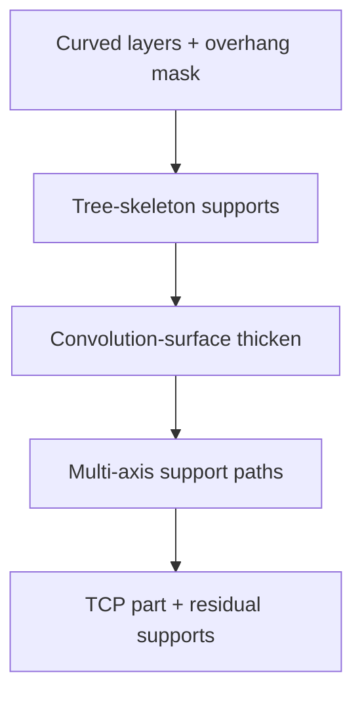

# #51 — Support generation for curved layers (2023)

- **Family:** B
- **Link:** —
- **Source:** compendium `paper-01.pdf` / `held-papers.json`

## When to use (adaptive slicer product)
- Multi-axis curved layers still leave local overhangs that fail the Part F local-overhang gate.
- Product needs residual supports that conform to curved layers (not planar-layer tree supports alone).
- After Dai/geodesic/S3/Neural/INF planning, a few regions remain unprintable without scaffolding.
- Booklet checklist: “Instant tip angle still needs support → rotate tool vector or add #51-style tree support.”
- Prefer as a safety-net module, not as the primary support-free strategy.
- Approach card B constraints: “Supports still sometimes needed (#51 tree-skeleton on curved layers).”

## Core idea (one sentence)
Grow tree-skeleton supports on curved layers and thicken them with a convolution surface for printable scaffolding.

## Algorithm (plain steps)
1. Detect unsupported regions on the curved-layer stack (local overhang / tip-angle failures after tool-vector retry).
2. Build a tree skeleton connecting unsupported points down to already-printed material or the bed/fixture.
3. Thicken the skeleton with a convolution surface into a solid support geometry compatible with curved-layer deposition.
4. Ensure support solids clear the nozzle envelope and do not collide with part surfaces intended to stay clean.
5. Slice / path the support along the same multi-axis schedule (or a dedicated support pass) with collision checks.
6. Schedule support removal / break-away relative to part layers; tag support feature type in the Part F per-point record; emit TCP.

## Constraints / what to expect
- Supports are residual — primary strategy should still be field/deformation support-free (#66/#45/#29); #51 is the safety net.
- Part F local-overhang gate is the trigger; also respect collision-free order when inserting support passes.
- Convolution thickening must stay clear of the nozzle envelope and part surfaces.
- Link missing in inventory — treat citation metadata as incomplete until DOI/arXiv is recovered.
- Not a substitute for redesign via G TO when overhang volume is huge.

## Data in
- Curved layers + tool vectors; overhang / unsupported mask; bed/fixture; clearance model.

## Data out
- Tree-skeleton + convolution support solids; support toolpaths tagged in the per-point record; TCP for D.

## Argument → proof sketch → conclusion
**Argument.** #51 wins when B fields nearly achieve support-free printing but product QA still sees local overhang failures that tool-vector rotation cannot fix.
**Proof sketch.** Held core idea: tree-skeleton supports on curved layers, thickened by convolution surface. Approach card B constraints note supports sometimes still needed (#51). Booklet multi-axis checklist explicitly names #51-style tree support as the local-overhang fallback.
**Conclusion.** Keep #51 as a post-B residual-support module; do not use it as the primary support-free strategy — that role belongs to Dai/S3/Neural/geodesic fields.

## Chaining
- Before: any B curved-layer pipeline (#66/#69/#16/#42/#45/#29/#18/#20/#68); optional tool-vector retry before adding supports.
- After: D motion for support + part paths; removal planning outside the slicer’s deposition loop.
- Do not chain with: pure 3-axis A planar support trees as a substitute when layers are curved (wrong geometry); do not skip B field design and jump straight to #51.

## Notes / inventory flags
- **Missing link:** held-papers `link` is empty; Part A table shows “—”. Flag for inventory maintainers to recover DOI/arXiv.
- Title in held-papers ends with an em-dash placeholder: “Support generation for curved layers (2023) —”.
- Convolution-surface lattices also appear elsewhere in the compendium (streaming slicing of convolution-surface lattices) — related geometry, different paper.
