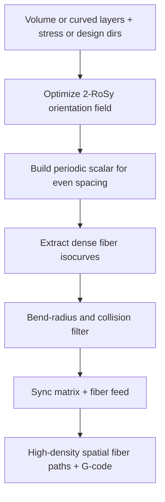

# #52 — High-density spatial fiber toolpaths (2024/25)

- **Family:** E (continuous fiber / anisotropy)
- **Link:** doi.org/10.1016/j.compositesb.2025.1121
- **Source:** compendium `paper-01.pdf` / `held-papers.json`

## When to use (adaptive slicer product)
- Need dense, evenly spaced continuous fibers in 3D / on curved layers (not just adaptive sparse stress isocurves).
- Direction field is intrinsically 2-RoSy (undirected line field) rather than a single vector — fibers have no preferred arrow.
- Spatial fiber reinforcement on multi-axis hardware where uniform packing quality matters for stiffness and printability.
- After B curved layers exist and #15-style adaptive density is too irregular for the part.

## Core idea (one sentence)
2-RoSy field plus periodic scalar for evenly spaced fibers.

## Algorithm (plain steps)
1. Obtain or optimize a 2-RoSy (line) orientation field on the printable volume or curved layers (stress-aligned or design-driven).
2. Build a periodic scalar field whose gradient is orthogonal to the RoSy direction so isocurves are evenly spaced fiber slots.
3. Extract dense isocurves as spatial fiber centerlines; trim to part domain.
4. Enforce bend-radius and collision with prior fibers; merge or drop illegal segments.
5. Optionally combine with hole loops (#10) or MILP selection (#27) where coverage must be exact.
6. Sync matrix + fiber extrusion; emit high-density spatial toolpaths for family D posing.

## Constraints / what to expect
- Even spacing trades off against pure stress-proportional density (#15); hybrid weighting may be needed.
- 2-RoSy singularities (branch points) need careful treatment or fibers bunch.
- DOI / journal year: inventory lists 2024 but Composites Part B DOI is 2025 (Part G ambiguity).
- Fiber bend radius and multi-axis collision order remain hard gates (Part F).

## Data in
- Curved layers or tet/surface domain; target orientation (FEA principals or design); desired fiber spacing; bend radius; matrix/fiber hardware limits.

## Data out
- Dense evenly spaced spatial fiber polylines; optional RoSy + scalar field for debug viz; fiber-aware TCP paths.

## Argument → proof sketch → conclusion
**Argument.** Adaptive stress isocurves (#15) can leave uneven gaps; a 2-RoSy orientation plus periodic scalar yields high-density, evenly spaced spatial fibers suited to continuous-fiber multi-axis printing.
**Proof sketch.** Stripe / periodic-scalar extraction on a 2-RoSy field is the standard evenly spaced curve method class — matching the held core idea. Approach-cards and booklet Scenario 2 cite #52 with #15 for E on B layers.
**Conclusion.** Product takeaway: choose #52 when packing uniformity and spatial density matter; choose #15 when stress-proportional sparsity matters; combine with #10 loops and #27/#22 for selection/sequencing, then D.

## Chaining
- Before: B curved layers (#42/#16/#45); G TO orientation (#48/#47) as RoSy seed; optional #15 field as warm start.
- After: #27 MILP or #22 Deep-Q for loop/tour refinement; D FRIK / singularity planning (#64/#49).
- Do not chain with: planar-only F thickness adapters expecting #52 output to stay 3-axis without a pose planner.

## Notes / inventory flags
- Dropped trailing OCR junk `54` from core_idea in JSON.
- Part G: “#52 is listed under 2024 but its DOI is Composites Part B 2025.”
- DOI string in inventory may be truncated (`…1121`); verify full article number when resolving the PDF.
- Software hint from approach-cards: geometry-central / stripe tools for evenly spaced curves.
