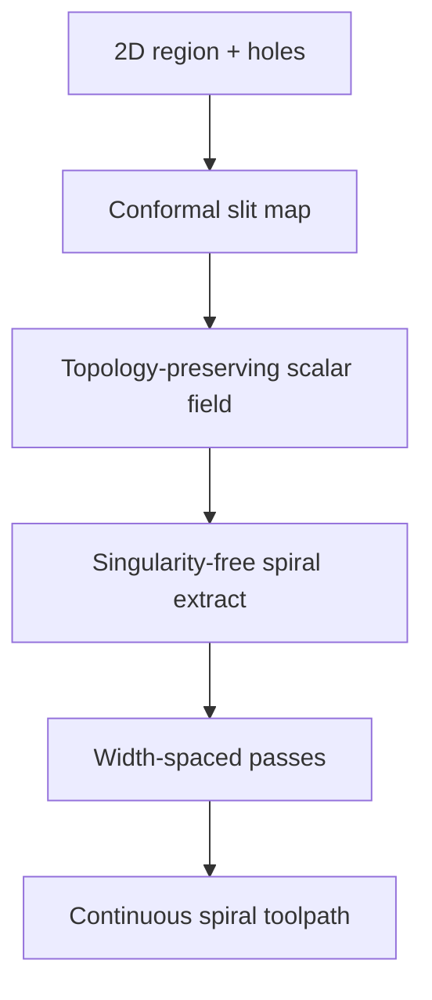

# #53 — Topology-preserving scalar field for spiral toolpaths (2025)

- **Family:** F-toolpath (general toolpath planning)
- **Link:** arxiv.org/abs/2512.22502
- **Source:** compendium `paper-01.pdf` / `held-papers.json`

## When to use (adaptive slicer product)
- Need a single boundary-conforming spiral fill without singularities inside the region.
- Contour-parallel / spiral infill where ordinary offset spirals break at holes or genus changes.
- Planar layers or flattened patches from C/A.

## Core idea (one sentence)
Build a singularity-free boundary-conforming spiral from a conformal slit-map scalar field.

## Algorithm (plain steps)
1. Take a 2-D region (slice or flattened patch) with outer boundary and holes.
2. Build a conformal slit map (or equivalent) yielding a topology-preserving scalar field.
3. Ensure the field has no interior singularities that would break a spiral.
4. Extract a spiral (or spiral-like) iso-traversal conforming to the boundary.
5. Space passes to nozzle width; connect into a continuous extrusion path.
6. Emit toolpath with minimal travels.

## Constraints / what to expect
- 2-D region method — curved 3-D layers need flatten-or-geodesic variants (hand off carefully).
- Conformal maps have numerical cost; cache per region.
- Prefer over naive offsets when holes cause offset singularities.

## Data in
- Planar region contours (outer + holes)
- Bead width / spiral pitch

## Data out
- Boundary-conforming spiral toolpath
- Scalar field (optional debug)

## Argument → proof sketch → conclusion
**Argument.** Spiral fills are product-valuable for continuous extrusion; topology-preserving fields stop the classic offset singularity failures.
**Proof sketch.** paper-01: singularity-free boundary-conforming spiral from a conformal slit map; approach-card F lists topology-preserving spiral #53.
**Conclusion.** Use #53 as the spiral fill backend; #9 when the pattern is a sparse Euler lattice instead.

## Chaining
- Before: #35/#2 contours; or patch boundaries from C.
- After: Thermal order #34 if needed; G-code post; can fill inside B layers if parameterized in layer charts.
- Do not chain with: Do not combine blindly with crossover-heavy rectilinear fills in the same region without a clear seam policy.

## Notes / inventory flags
- arXiv 2512.22502.
- Part B note in paper-01 mentions checking other methods vs #53 baseline — inventory cross-ref only.
