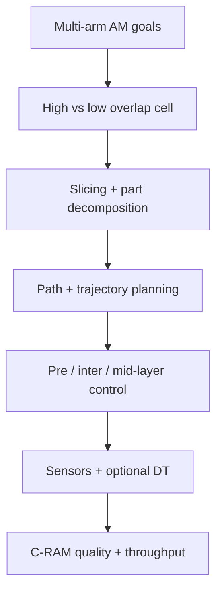

# #54 — Cooperative robotics in AM (review 2024)

- **Family:** D
- **Link:** arxiv.org/abs/2408.04827
- **Source:** compendium `paper-01.pdf` / `held-papers.json`

## When to use (adaptive slicer product)
- Scoping a **multi-arm / C-RAM** product: high-overlap (multi-material, multi-resolution, cooperative sensing) vs low-overlap (large-scale homogeneous tooling).
- Choosing where intelligence lives: slicing / decomposition, motion planning, or process control (pre-process / inter-layer / mid-layer) and whether a digital twin is warranted.
- Inventorying defect sources that multi-robot scheduling and seams introduce beyond single-arm RAM.

## Core idea (one sentence)
Survey how cooperative robotic AM systems combine multi-arm slicing, motion planning, sensing, and digital twins to enlarge build volume and speed while managing defects across pre-process, inter-layer, and mid-layer control.

## Algorithm (plain steps)
*(Taxonomy of surveyed approaches — not a single pipeline.)*
1. **Classify cell geometry:** compute exclusive vs joint build volumes; volume ratio \(r_V=V_e/V_j\) → low-overlap (large-scale, \(r_V\geq 1\)) vs high-overlap (hetero tooling / sensing, \(r_V<1\)).
2. **Slicing / toolpath family:** planar; discrete or continuous multi-plane; conformal or arbitrary non-planar; then **C-RAM decomposition** (planar cuts, interlocking interfaces, bead scoring for assignment).
3. **Collision policy:** pre-process scheduling that serializes overlap regions vs online motion-plan collision checks (e.g. SCARA swept-area pause).
4. **Motion planning stack:** path planning (APF / heuristic A* family / PRM / RRT / ML planners) + trajectory planning under task-constrained TCP; prefer constrained/online methods when sensing closes the loop.
5. **Process-control level:** pre-process (parameter & pose calibration, \(AXB=YCZ\) multi-arm frames); inter-layer (laser / structured light / ultrasonic / ECT on a secondary arm); mid-layer (coaxial cameras, melt-pool IR, head-mounted scanners, multi-modal ML).
6. **Digital twin tier:** digital model → digital shadow → closed-loop digital twin at micro/meso/macro fidelity.
7. **Map gaps to product backlog:** unified multi-arm slicing software; quality-informed slicing; informed decomposition; intelligent monitored C-RAM; open DT tooling.
8. Hand concrete cells to D executors (#49/#64/#39/#63) and TOPP-RA timing.

## Constraints / what to expect
- Review paper: synthesizes ME (FFF/FDM) and DED (WAAM, L-DED) RAM/C-RAM literature; does not ship a single runnable algorithm.
- Multi-arm seams and desynchronized cooling are first-class defect sources — mechanical data on interface design remain sparse in the surveyed corpus.
- Manufacturer closed software (easy) vs ROS/ROS2 (flexible, harder) trade-off for sensing-rich cells.
- Terminology in the field is non-standardized (RAM / C-RAM / multi-arm / collaborative vs cooperative).
- Extrusion still must track tip speed; multi-arm schedules must not violate continuous-bead constraints without planned stops.

## Data in
- For using the taxonomy: target part scale, material process (ME/DED), number of arms, overlap intent, available sensors, open- vs closed-loop ambitions.
- For a concrete cell derived from it: CAD, kinematic models, calibration targets, sensor streams.

## Data out
- Design decisions: cell class, slicing mode, decomposition rule, planner class, control level, DT ambition.
- Pointers into primary literature for each branch; product gap list for an adaptive slicer’s multi-robot roadmap.

## Argument → proof sketch → conclusion
**Argument.** Single-arm RAM already beats gantries on DoF and out-of-bounds volume, but large-scale and hetero-tool jobs need cooperative arms — and quality then hinges on coupled slicing, motion, and multi-timescale sensing, which prior surveys under-covered.
**Proof sketch.** Organize literature by build-volume overlap; separate toolpath planning from IK/motion planning; bin defect mitigation by pre-/inter-/mid-layer feedback; place digital twins on a model→shadow→twin ladder; surface five research gaps that block production-grade C-RAM.
**Conclusion.** Treat cooperative AM as a system-control + process-control stack; use this taxonomy to pick D building blocks rather than bolting a second arm onto a single-arm slicer.

## Chaining
- Before: product requirements for scale, materials, sensors; single-arm B/C/E path demos that outgrew one workspace.
- After: implement with #63 (online env paths), #39 (mobile print-while-moving), #49/#64 (IK), TOPP-RA; wire inter-layer scanners into re-slice loops.
- Do not chain with: assuming the review alone yields G-code; ignoring decomposition mechanics when claiming “N× speedup”; using human–robot “collaborative” papers as drop-in C-RAM schedules.

## Notes / inventory flags
- arXiv 2408.04827; journal path Robot. Comput. Integr. Manuf. (authors Rescsanski et al., UConn / UIC).
- Keywords in paper: Intelligent Robotics, Sensing and Control, Motion Planning and Slicing, Digital Twins.
- Use as the family-D survey hub for multi-robot printing in the adaptive slicer docs.
