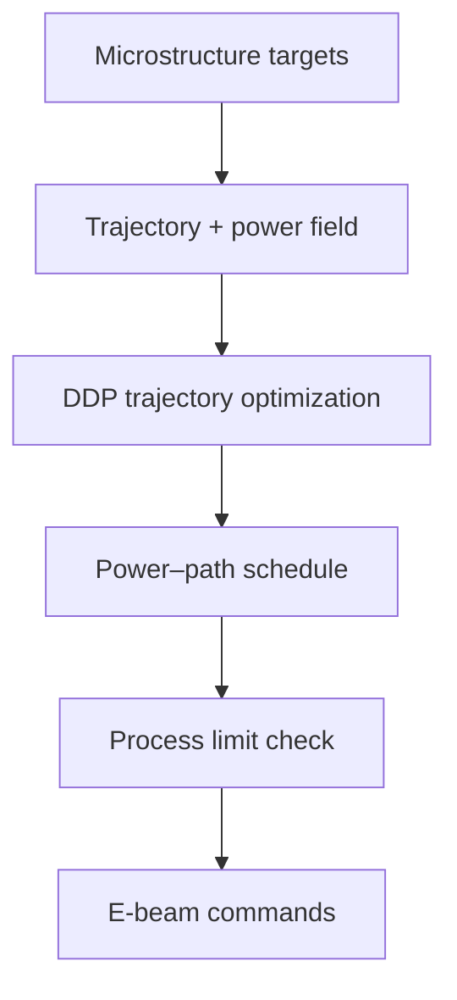

# #55 — Trajectory optimization for microstructure control (2024)

- **Family:** F-toolpath (general toolpath planning)
- **Link:** arxiv.org/abs/2410.18207
- **Source:** compendium `paper-01.pdf` / `held-papers.json`

## When to use (adaptive slicer product)
- Energy-beam processes (E-beam context in corpus) where power-field trajectories steer microstructure.
- Product adjacent to PBF/DED-like scan strategy more than FFF beads — keep scoped.
- When scan/power scheduling is the toolpath, not extrusion width.

## Core idea (one sentence)
Optimize E-beam power-field trajectories with differential dynamic programming (DDP) for microstructure control.

## Algorithm (plain steps)
1. Define target microstructure / thermal history proxies on the region.
2. Parameterize E-beam trajectory and power field.
3. Formulate an optimal-control objective (microstructure + constraints).
4. Solve with DDP (or related trajectory optimization) for power–path schedules.
5. Validate against process limits (power, speed, spacing).
6. Emit machine scan / power commands.

## Constraints / what to expect
- Corpus places this under F-toolpath but process is E-beam — not drop-in for FFF adaptive slicer defaults.
- Microstructure models are process-specific.
- Part G notes metal multi-axis nearly absent — do not over-claim FFF transfer.

## Data in
- Region geometry / scan domain
- Microstructure targets and E-beam limits

## Data out
- Optimized trajectory + power schedule
- Machine-oriented scan commands

## Argument → proof sketch → conclusion
**Argument.** Scan-strategy toolpaths are the PBF analogue of FFF path planning; DDP power-field control is the held method for microstructure.
**Proof sketch.** paper-01 F-toolpath row: E-beam power-field optimization with DDP (arxiv 2410.18207).
**Conclusion.** Keep #55 in the toolpath library for beam processes; do not auto-enable in MEX profiles.

## Chaining
- Before: Process model / microstructure target definition.
- After: Machine execution; inspection loops if available.
- Do not chain with: Do not chain into A Song/ZAA or E fiber MEX paths as if it were extrusion geometry.

## Notes / inventory flags
- arXiv 2410.18207.
- Flag: process category closer to PBF/E-beam than MEX; inventory still lists F-toolpath.
