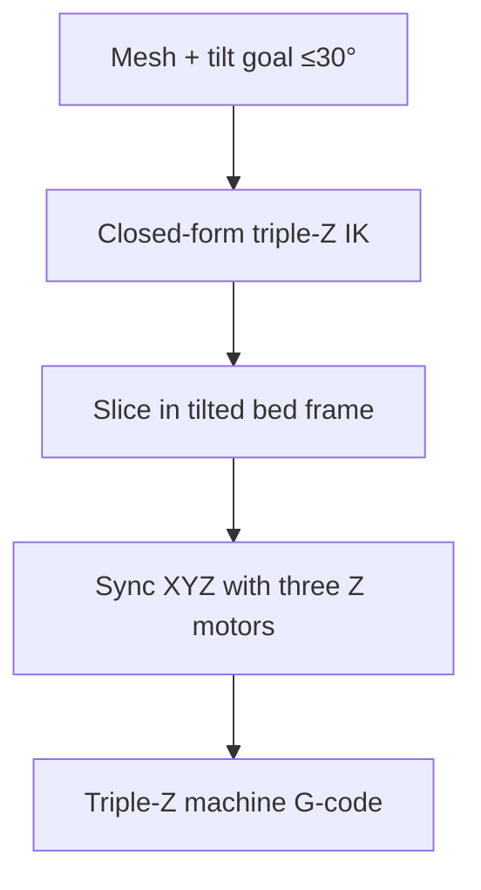

# #56 — Triple Z-axis FFF (2025)

- **Family:** A
- **Link:** hal.science/hal-05366062
- **Source:** compendium `paper-01.pdf` / `held-papers.json`

## When to use (adaptive slicer product)
- Bridge from stock 3-axis toward mild multi-orientation without a full robot: bed tilted by three Z motors.
- RatRig-class machine; local tilt up to ~30°.
- Indexed-style non-planar / tilted-layer prints still in Family A hardware budget.

## Core idea (one sentence)
Bed tilted by three independent Z motors (up to 30°); closed-form IK on a RatRig.

## Algorithm (plain steps)
1. Target a print orientation / bed tilt within the ≤30° envelope.
2. Compute closed-form inverse kinematics mapping desired bed plane to three independent Z motor positions.
3. Slice layers in the tilted bed frame (planar in bed coordinates).
4. Synchronize XYZ tool motion with the three Z actuators per the IK.
5. Emit machine code for the triple-Z RatRig-class printer.

## Constraints / what to expect
- Tilt envelope up to ~30° (Part A); not full 5-axis freedom.
- Requires three independent Z motors and calibration of bed plane / nozzle length (Part F pitfalls).
- Collisions with gantry/bed still possible at tilt — check workspace.
- Closed-form IK is machine-class specific (RatRig demonstrated).

## Data in
- Mesh; desired tilt / layer normals within 30°; machine kinematic parameters (Z motor layout).

## Data out
- Joint/actuator commands for three Z motors + XY(Z) toolpath; tilted-layer G-code dialect.

## Argument → proof sketch → conclusion
**Argument.** Some parts need more than cone-limited skins but the user will not deploy a robot arm—tilting the bed is the incremental hardware step.
**Proof sketch.** Part A (#56) and decision map: triple-Z (≤30°, closed-form IK on RatRig) is Family A’s bridge toward multi-axis. Part F lists triple-Z tilt bed among printer kinematic variants.
**Conclusion.** Offer Triple-Z mode when cone-limited A fails mildly and Open5x/robot (C/D) is too heavy; keep simultaneous 5-axis / B fields for steeper cases.

## Chaining
- Before: planar or Family-A height-field slice in bed frame; optional #32 shell while bed is level.
- After: D-style motion checks only if adding extra axes; else print.
- Do not chain with: assuming TCP robot outputs (#49/#64) without an adapter; avoid B iso-surface layers unless kinematics upgraded.

## Notes / inventory flags
- HAL: hal.science/hal-05366062.
- Approach cards: bridge toward multi-axis; software neighbours include Open5x (#33) for rotary+tilt class.
