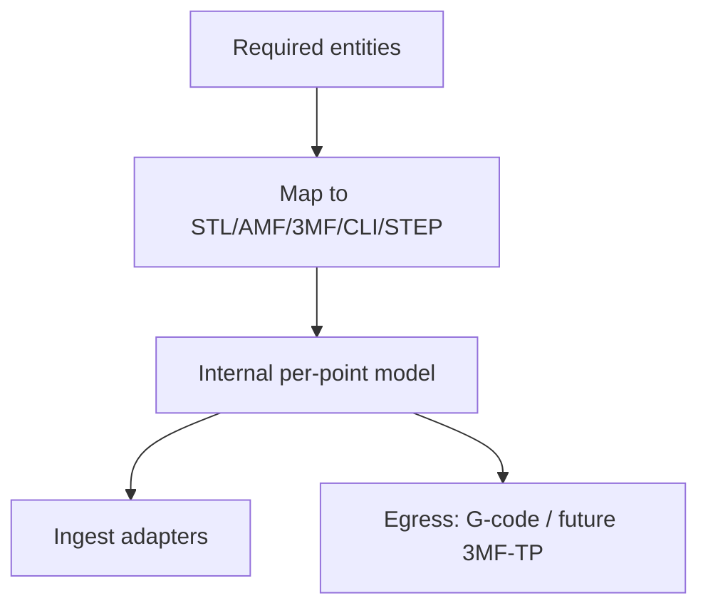

# #57 — Survey of AM data representations (STL/AMF/3MF/CLI/STEP)

- **Family:** F-planar (adaptive slicing / mesh formats)
- **Link:** —
- **Source:** compendium `paper-01.pdf` / `held-papers.json`

## When to use (adaptive slicer product)
- Choosing import/export formats for the adaptive slicer (mesh vs AMF vs 3MF vs CLI vs STEP).
- Product architecture decisions on what metadata (units, materials, colors, lattices) must survive the data chain.
- Planning adapters toward future 3MF toolpath / STEP-NC entities (watch, not sole runtime).

## Core idea (one sentence)
Survey of AM data representations spanning STL, AMF, 3MF, CLI, and STEP for process pipelines.

## Algorithm (plain steps)
1. Inventory required entities: geometry, units, materials, colors, lattices, slices, toolpaths.
2. Map entities onto STL / AMF / 3MF / CLI / STEP capabilities from the survey.
3. Pick a runtime internal model (per-point record) independent of any one file format.
4. Implement ingest adapters (prefer 3MF/AMF over bare STL when metadata matters).
5. Implement egress adapters (G-code now; 3MF toolpath / STEP-NC when extrusion entities mature).
6. Document lossy edges (STL drops units/materials; CLI is slice-oriented; etc.).

## Constraints / what to expect
- Survey paper — not an algorithm to run at slice time.
- Booklet Part G: 3MF Toolpath Extension v1.0.0 is laser/PBF-oriented; extrusion fit untested; STEP-NC Part 17 still lacks FDM/LMD entities.
- ScienceDirect-only link in inventory → use `—`.

## Data in
- Product requirements for geometry + metadata
- Target machines / partners’ accepted formats

## Data out
- Format selection matrix
- Adapter roadmap and known information-loss edges

## Argument → proof sketch → conclusion
**Argument.** Non-planar pipelines fail quietly when units, materials, or toolpath semantics are lost at the file boundary.
**Proof sketch.** approach-card F when-to-use and chaining cite #57 for choosing STL vs AMF vs 3MF vs CLI vs STEP; booklet §7 flags 3MF/STEP-NC gaps.
**Conclusion.** Use #57 to design I/O adapters; keep the per-point record as runtime truth.

## Chaining
- Before: Product requirements / ISO-ASTM process category (MEX vs VPP etc.).
- After: All families’ ingest/egress adapters; mesh repair #58 on STL paths.
- Do not chain with: Do not treat 3MF toolpath v1 as the only extrusion runtime format yet.

## Notes / inventory flags
- ScienceDirect S0010448518304202 (from paper-01.txt); link field was “ScienceDirect” → `—`.
- Family F-planar per inventory grouping with mesh/data formats.
