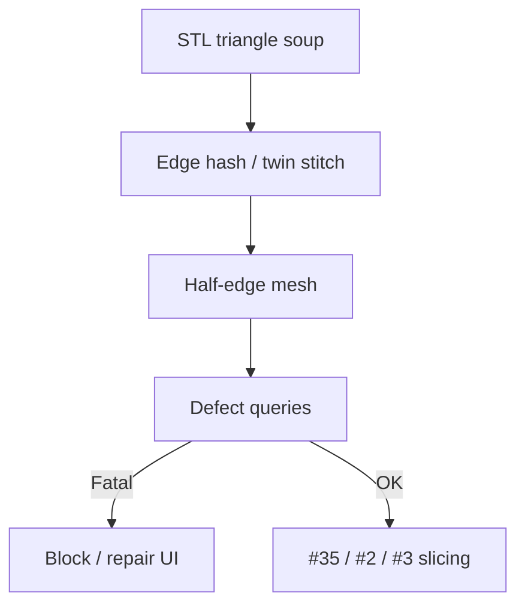

# #58 — Half-edge topology on STL soup for defect queries (2003)

- **Family:** F-planar (adaptive slicing / mesh formats)
- **Link:** —
- **Source:** compendium `paper-01.pdf` / `held-papers.json`

## When to use (adaptive slicer product)
- Ingested STL is a triangle soup; slicer must detect holes, non-manifold edges, inverted faces before adaptive slice.
- Product QC gate: “mesh ok to slice?” with topological defect queries.
- Before #35 sweep slicing or #2/#3 adaptive contours.

## Core idea (one sentence)
Build half-edge topology on an STL triangle soup so defect queries become local adjacency walks.

## Algorithm (plain steps)
1. Read STL facets as an unordered triangle soup.
2. Hash edges and stitch twin half-edges where matches exist.
3. Index vertices/faces for half-edge traversal.
4. Query defects: boundary loops, non-manifold edges, inconsistent orientation, disconnected components.
5. Report or attempt repair hooks; block slice on fatal defects.
6. Pass a manifold-enough mesh to #35 / adaptive modules.

## Constraints / what to expect
- Half-edge cannot invent missing geometry; some soups need external repair.
- Old (2003) method — still the right *idea* for STL hygiene in a modern stack.
- ScienceDirect-only → link `—`.

## Data in
- STL triangle soup (or mesh without reliable adjacency)
- Defect policy thresholds

## Data out
- Half-edge mesh + defect report
- Cleaned / flagged mesh for downstream slicing

## Argument → proof sketch → conclusion
**Argument.** Adaptive and non-planar stages assume watertight-enough topology; STL soup breaks contour chaining silently.
**Proof sketch.** approach-card F lists #58 for mesh hygiene / half-edge on STL soup before format and path stages.
**Conclusion.** Run #58 (or equivalent half-edge repair) as a mandatory ingest gate on STL paths.

## Chaining
- Before: Format choice (#57); user upload.
- After: #35 mesh slicing → #2/#3 adapt → A/B/C families.
- Do not chain with: Do not skip hygiene and hope #35 hashing will close gaps.

## Notes / inventory flags
- ScienceDirect S0895717703900793 (2003) from paper-01.txt; link was “ScienceDirect” → `—`.
- Title cleaned to descriptive form from core idea.
