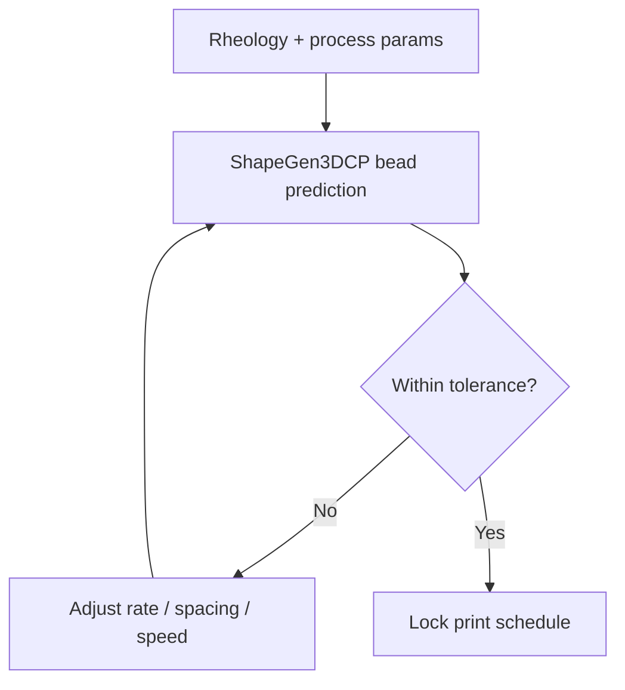

# #59 — ShapeGen3DCP (2025)

- **Family:** Process (modeling / inspection / concrete)
- **Link:** arxiv.org/abs/2510.02009
- **Source:** compendium `paper-01.pdf` / `held-papers.json`

## When to use (adaptive slicer product)
- 3D concrete printing (3DCP) where bead shape depends on rheology and process parameters.
- Predict deposited cross-section before committing to a wall path.
- Adaptive concrete slicer / planner needing shape feedback.

## Core idea (one sentence)
Predict concrete bead shape from rheology and process parameters.

## Algorithm (plain steps)
1. Characterize fresh concrete rheology (and related process params: rate, nozzle, height).
2. Run ShapeGen3DCP prediction for the deposited bead cross-section.
3. Compare predicted bead to target wall geometry / overlap policy.
4. Adjust speed, extrusion rate, or path spacing.
5. Re-predict; iterate until shape tolerance is met.
6. Lock parameters into the print schedule; monitor on-line if sensors exist (#60).

## Constraints / what to expect
- Concrete-specific; not plastics FFF without re-identification.
- Prediction ≠ guarantee under site temperature/humidity drift — pair with inspection.
- Process modeling card.

## Data in
- Rheology parameters
- Nozzle geometry, feed rate, travel speed, layer height
- Target bead / wall profile

## Data out
- Predicted bead shape
- Recommended process parameter set

## Argument → proof sketch → conclusion
**Argument.** Concrete beads deform after leaving the nozzle; geometry planning must include rheology-aware shape prediction.
**Proof sketch.** paper-01 Process: concrete bead-shape prediction from rheology and process (arxiv 2510.02009).
**Conclusion.** Use #59 in the 3DCP parameter loop before long walls; close with #60 sensors.

## Chaining
- Before: Mix design; path draft (possibly helical #61).
- After: #60 inspection QC; #61 digital chain FEM.
- Do not chain with: Do not use as a substitute for structural TO (G) of the architectural part.

## Notes / inventory flags
- arXiv 2510.02009.
- Concrete cluster with #60/#61.
