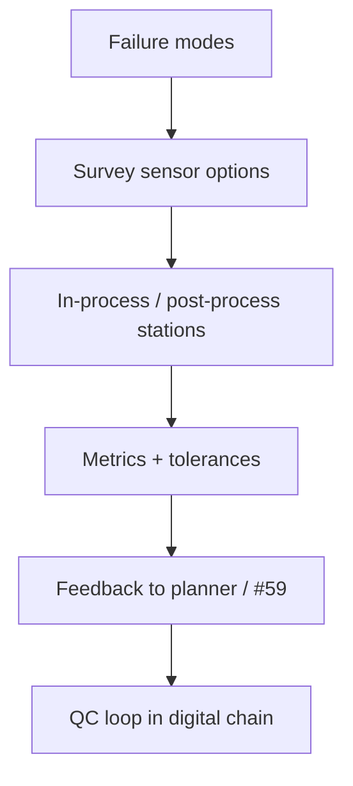

# #60 — Geometry/surface inspection in 3D concrete printing (review)

- **Family:** Process (modeling / inspection / concrete)
- **Link:** arxiv.org/abs/2503.07472
- **Source:** compendium `paper-01.pdf` / `held-papers.json`

## When to use (adaptive slicer product)
- Designing QC loops for 3DCP cells (sensors, metrics, feedback).
- Product/process engineering choosing among geometry and surface inspection modalities.
- Closing the loop around #59 predictions and #61 workflows.

## Core idea (one sentence)
Survey sensors and QC loops for geometry and surface inspection in 3D concrete printing.

## Algorithm (plain steps)
1. List failure modes of interest (layer squish, tears, deviation, surface voids).
2. Map survey sensor classes (vision, laser, etc.) to those modes.
3. Define in-process vs post-process QC stations in the digital chain.
4. Choose metrics and tolerances tied to structural/architectural specs.
5. Wire feedback: pause, re-parameterize (#59), or scrap.
6. Document the QC loop beside the slicer/planner release.

## Constraints / what to expect
- Review paper — synthesizes options; does not ship one algorithm.
- Site robustness (dust, lighting) dominates lab sensors.
- Concrete-focused.

## Data in
- Process risk register
- Cell layout and budget for sensors

## Data out
- Selected sensor + metric stack
- QC feedback policy to planner

## Argument → proof sketch → conclusion
**Argument.** Without inspection, rheology prediction and digital chains drift in the field.
**Proof sketch.** paper-01 Process: survey of sensors and QC loops (arxiv 2503.07472).
**Conclusion.** Use #60 to design the QC layer around #59/#61/#24-style twins.

## Chaining
- Before: Process planner (#59/#61); risk analysis.
- After: Live feedback into parameter updates; archival quality records.
- Do not chain with: Do not treat the review as a single turnkey algorithm implementation.

## Notes / inventory flags
- arXiv 2503.07472.
- Review/survey inventory type.
