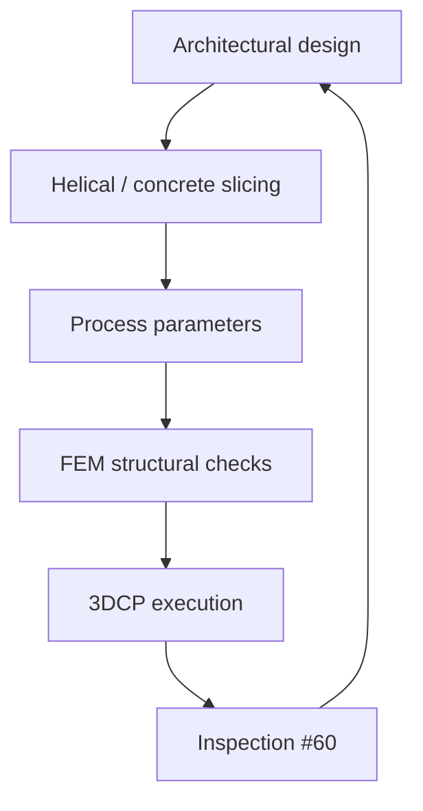

# #61 — Digital chain in concrete 3D printing (2024)

- **Family:** Process (modeling / inspection / concrete)
- **Link:** arxiv.org/abs/2410.16319
- **Source:** compendium `paper-01.pdf` / `held-papers.json`

## When to use (adaptive slicer product)
- Standing up an end-to-end 3DCP workflow from design through helical slicing to FEM.
- Architectural/construction prints needing a coherent digital chain, not only a path file.
- Integrating process modeling with structural checks.

## Core idea (one sentence)
Provide an end-to-end concrete 3D printing workflow including helical slicing and FEM.

## Algorithm (plain steps)
1. Ingest architectural design / printable shell or wall system.
2. Apply concrete-aware path planning (including helical slicing where used).
3. Set process parameters with rheology awareness (#59).
4. Simulate / FEM critical load cases on the as-planned or as-printed model.
5. Send schedules to the printer; monitor with inspection (#60).
6. Feed deviations back into the chain for the next segment/build.

## Constraints / what to expect
- End-to-end scope — heavy integration work.
- Helical slicing is concrete-path specific; do not confuse with FFF Z helices without revalidation.
- FEM assumptions must match fresh vs hardened concrete stages.

## Data in
- Design model
- Mix / rheology / machine limits
- Load cases for FEM

## Data out
- Helical (or concrete) toolpath schedule
- FEM results + print package
- Loop hooks for QC

## Argument → proof sketch → conclusion
**Argument.** Concrete AM fails when slicing, process, and structural analysis live in disconnected tools.
**Proof sketch.** paper-01 Process: end-to-end workflow incl. helical slicing and FEM (arxiv 2410.16319).
**Conclusion.** Treat #61 as the integration spine for 3DCP products; plug #59/#60/#24 into it.

## Chaining
- Before: Design + mix qualification.
- After: On-site print + inspection + twin updates.
- Do not chain with: Do not silently reuse FFF A Song/ZAA as the concrete layer engine.

## Notes / inventory flags
- arXiv 2410.16319.
- Digital-chain companion to meshing twin #24 (extrusion FEA mesh).
