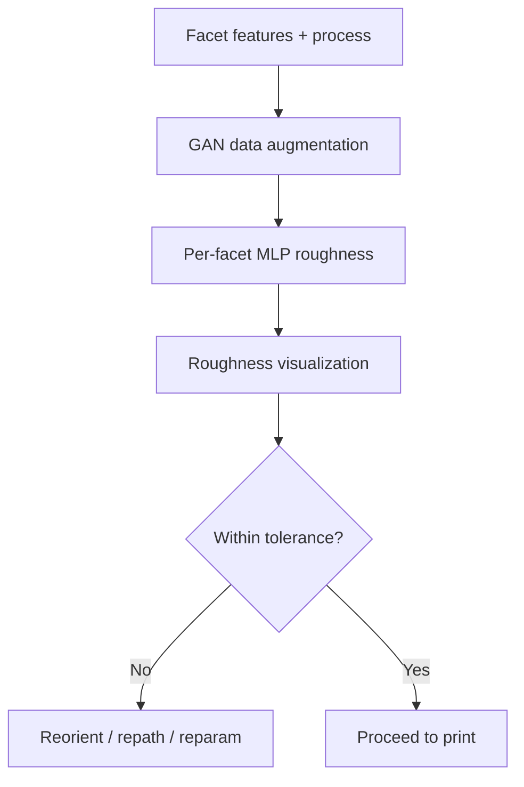

# #62 — Surface roughness prediction and visualization (2026)

- **Family:** Process (modeling / inspection / concrete)
- **Link:** arxiv.org/abs/2603.09353
- **Source:** compendium `paper-01.pdf` / `held-papers.json`

## When to use (adaptive slicer product)
- Predict and visualize surface roughness per facet before printing (planning / DfAM feedback).
- Limited measured data — GAN augmentation helps train roughness predictors.
- Quality estimation alongside geometric twins (#24).

## Core idea (one sentence)
Predict per-facet surface roughness with an MLP, using GAN augmentation for training data.

## Algorithm (plain steps)
1. Collect facet-level features (orientation, process params, local geometry).
2. Augment scarce roughness datasets with a GAN.
3. Train a per-facet MLP roughness predictor.
4. Run prediction on the planned part facets / toolpath neighborhoods.
5. Visualize roughness maps for designer or slicer UI.
6. Optionally gate builds that exceed roughness tolerances.

## Constraints / what to expect
- Learned predictor — domain shift across machines/materials needs recalibration.
- Visualization aids decisions; does not replace metrology (#60) for sign-off.
- Dated 2026 in inventory.

## Data in
- Part facets / orientation features
- Process parameters
- Optional measured roughness training set

## Data out
- Per-facet roughness predictions
- Visualization maps / gate decision

## Argument → proof sketch → conclusion
**Argument.** Surface quality is a first-class adaptive-slicer output metric; predicting it early avoids failed builds.
**Proof sketch.** paper-01 Process: per-facet MLP roughness with GAN augmentation (arxiv 2603.09353).
**Conclusion.** Use #62 in preflight UI; confirm critical surfaces with inspection sensors from #60.

## Chaining
- Before: Oriented toolpaths / layers from any MEX or concrete planner.
- After: Rebuild orientation or parameters; final metrology.
- Do not chain with: Do not treat MLP maps as certified QC without sensor confirmation on critical parts.

## Notes / inventory flags
- arXiv 2603.09353.
- Process-family quality companion to #24 twins and #60 inspection survey.
