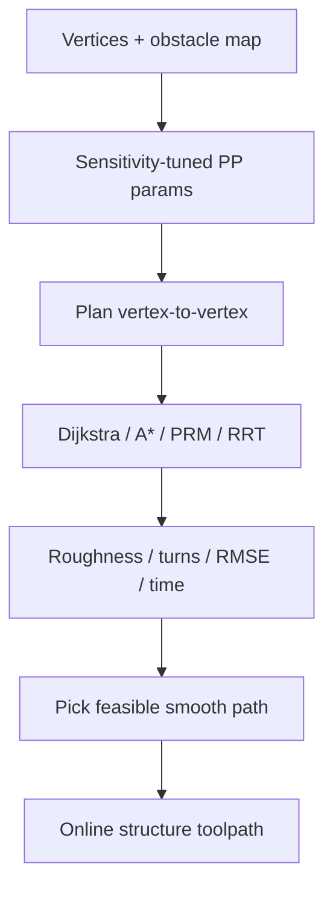

# #63 — Environment-aware path generation for robotic AM (2026)

- **Family:** D
- **Link:** arxiv.org/abs/2603.05748
- **Source:** compendium `paper-01.pdf` / `held-papers.json`

## When to use (adaptive slicer product)
- On-site / expeditionary / outdoor robotic construction where **obstacles are known only at print time** — offline CAD→slice G-code cannot see the workspace.
- User supplies a sparse set of fixed vertices (open wall: start/end; closed polygon: corner list); the slicer must generate vertex-to-vertex deposition paths online around obstacles.
- Benchmarking classical planners (Dijkstra, A*, RRT, PRM) for AM bead quality, not just geometric reachability.

## Core idea (one sentence)
Generate the structure’s toolpath online between user vertices by running search- and sampling-based planners in an obstacle-aware workspace, and score paths with AM-specific structural metrics (roughness, turns, RMSE, …).

## Algorithm (plain steps)
1. User provides fixed vertices for an **open** structure (2 points) or **closed** structure (e.g. hexagon, 6 points) and an obstacle map (random or periodic).
2. Tune planner hyperparameters via sensitivity analysis (grid size, RRT expansion, PRM neighbors / edge length, path resolution ≈ filament width).
3. For each consecutive vertex pair, run one of: Dijkstra, A*, PRM, RRT (PythonRobotics) to find an obstacle-free polyline.
4. For closed shapes, chain pair solutions in order around the polygon.
5. Score each path with structural metrics: roughness (mean absolute heading change), number of turns, max offset from straight chord, RMSE of deviation, path-length ratio; plus run time.
6. Select planner/path by the product policy (smoothness for continuous extrusion vs corner avoidance); optionally smooth sharp corners with robot look-ahead / blending.
7. Hand the polyline to IK / FRIK / singularity-aware stages; time with TOPP-RA; extrude with tip-speed sync.

## Constraints / what to expect
- Evaluated in dense obstacle fields that saturate feasibility (e.g. hundreds of point obstacles in an 800×800 mm workspace) — RRT tends to fail first; Dijkstra/A* most reliable.
- Paper’s essential AM metrics: **roughness, number of turns, RMSE** (path deviation least discriminative; offset duplicates RMSE somewhat).
- Produces 2D planar structure skeletons (open wall / closed polygon), not full multi-axis curved layers — escalate to B/C for freeform shells.
- Online ≠ full closed-loop sensing of the growing print; it is environment-aware of workspace obstacles given a map.
- Path resolution should match bead width so collision checks respect deposited geometry.

## Data in
- Ordered target vertices; 2D workspace bounds; obstacle set (positions/radii or occupancy); planner choice + tuned params; filament/path resolution.

## Data out
- Feasible polylines between vertices (open or closed); per-path metric vector; chosen planner tag; optional smoothed path for robot execution.

## Argument → proof sketch → conclusion
**Argument.** Conventional AM assumes an a-priori CAD toolpath; terrestrial/extraterrestrial sites with obstacles need online vertex-to-vertex generation scored for printability, not only graph connectivity.
**Proof sketch.** Embed four classical planners in a PGF; stress-test random vs periodic obstacles on open and closed targets; compare run time and structural metrics; Dijkstra then A* dominate dense cases, RRT fails earliest; prescribe roughness + turns + RMSE as the sufficient metric set.
**Conclusion.** Environment-aware online path generation is a family-D front door for construction AM: pick Dijkstra/A*-class links, then feed D kinematics/timing.

## Chaining
- Before: sparse design intent / site survey (vertices + obstacle map); optionally G TO for printable volume shape.
- After: D IK (#49 / #64), collision-aware transfer links, TOPP-RA; process control for concrete/clay extrusion.
- Do not chain with: assuming the PGF replaces B curved-layer fields or C conformal shells; using RRT alone in dense sites without a Dijkstra/A* fallback; treating metrics as mechanical FEA strength proof.

## Notes / inventory flags
- arXiv 2603.05748 (submitted Mar 2026); Princeton CEE (Rabiei & Moini).
- Implementation note: PythonRobotics library for the four planners.
- Complements printing-while-moving (#39) and cooperative review (#54) for large-scale construction cells.
