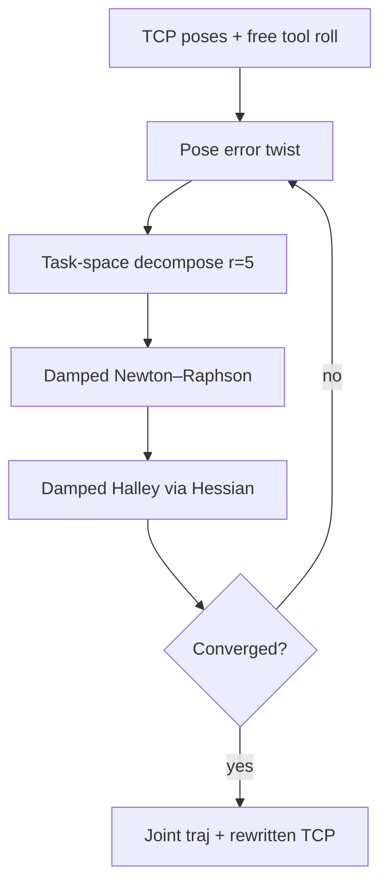

# #64 — FRIK: fast redundant IK (2025)

- **Family:** D
- **Link:** arxiv.org/abs/2512.10116
- **Source:** compendium `paper-01.pdf` / `held-papers.json`

## When to use (adaptive slicer product)
- Six-axis industrial arms executing AM / cold-spray / WAAM / welding toolpaths where the **tool axis is rotationally symmetric** (free roll about the nozzle) — functional 5-DoF task on a 6-DoF robot.
- Offline graph planners (e.g. Descartes) are too slow/memory-heavy for long toolpaths; you need fast, reactive joint solutions that expand reachable workspace and cut joint travel.
- After B/C/E tip paths exist; before or instead of heavy sampling-based redundancy resolution; pair with TOPP-RA for timing.

## Core idea (one sentence)
Treat tool roll as free via task-space decomposition, then solve damped least-squares IK with Halley (second-order) steps so solutions are fast, singularity-robust, and minimize instantaneous joint motion.

## Algorithm (plain steps)
1. Import discrete desired TCP poses \(\mathbf{T}_d(k)\) from the slicer (position + approach normal; roll initially arbitrary).
2. Form 6D pose error twist \(\mathbf{e}=\log(\mathbf{T}_e\mathbf{T}_d^{-1})\); saturate large steps.
3. Task-space decompose: rotate twist/Jacobian into the desired frame, project with \(\mathbf{T}_{r=5}\) that **drops rotation about tool Z** → \(\hat{\mathbf{J}}\) (\(5\times n\)), \(d\hat{\mathbf{x}}\) (\(5\times 1\)).
4. Damped Newton–Raphson step: \(\partial\mathbf{q}_{\mathrm{dnr}}=\hat{\mathbf{J}}^T(\hat{\mathbf{J}}\hat{\mathbf{J}}^T+\lambda^2 I)^{-1}d\hat{\mathbf{x}}\).
5. Form augmented matrix \(\mathbf{A}=\mathbf{J}+\tfrac12\mathbf{H}\partial\mathbf{q}_{\mathrm{dnr}}\) (kinematic Hessian); project to task space \(\hat{\mathbf{A}}\).
6. Damped Halley step: \(d\mathbf{q}=\hat{\mathbf{A}}^T(\hat{\mathbf{A}}\hat{\mathbf{A}}^T+\lambda^2 I)^{-1}d\hat{\mathbf{x}}\); update \(\mathbf{q}\leftarrow\mathbf{q}+d\mathbf{q}\).
7. Iterate until \(\|d\hat{\mathbf{x}}\|<\epsilon\) (or max iters); warm-start each waypoint from the previous \(\mathbf{q}\).
8. Forward-kinematics rewrite of TCP (now with optimized roll); time-parameterize (TOPP-RA); emit robot program (ABB RAPID etc.).
9. Optionally map workpiece placement over the cell and pick a pose with high reachable fraction / manipulability.

## Constraints / what to expect
- Local / greedy: minimizes instantaneous \(d\mathbf{q}\) given \(\mathbf{q}_0\); not globally optimal over long trajectories (paper notes combining with sampling planners as future work).
- Does not by itself do obstacle avoidance, joint-limit avoidance, or energy objectives (null-space secondary tasks possible but out of scope of the paper).
- Sensitive to sim-to-real calibration of workpiece pose — miscalibration warps wrist joints.
- Validated on ABB IRB4600 + cold-spray gun; conical non-planar spiral toolpath (~0.2 ms/step).
- Reported: ~92% more reachable workpiece voxels vs ad-hoc roll; ~17% less total joint-space travel (do not invent further metrics).

## Data in
- Sequence of desired TCP frames (position + tool Z from B/C/E); robot DH / URDF; initial \(\mathbf{q}_0\); damping \(\lambda\); convergence \(\epsilon\).
- Optional: workpiece placement grid, joint limits for manipulability map.

## Data out
- Joint trajectory \(\mathbf{q}(k)\); updated TCP with resolved roll; optional reachability / manipulability map; robot language program.

## Argument → proof sketch → conclusion
**Argument.** Symmetrical AM tools only constrain 5 DoF; fixing roll ad hoc shrinks the reachable workspace and inflates wrist travel, while offline semi-constrained planners scale poorly.
**Proof sketch.** Project the Jacobian/error into a 5-DoF task (drop tool-Z rotation); regularize with damped least squares; accelerate with Halley’s method using the kinematic Hessian; compare ad-hoc vs FRIK on a conical cold-spray path — more reachable placements and shorter joint paths at ~200 µs/step.
**Conclusion.** Functional redundancy belongs in the IK solver for AM toolpaths: freer roll + damped Halley yields fast, practical motion plans for 6-axis cells.

## Chaining
- Before: B/C/E (or singularity-aware #49 if path came from a 5-axis Cartesian then moved to a robot cell); Continuous3D-style non-planar spray/print paths.
- After: TOPP-RA timing; robot controller; optional environment-aware link planners (#63) for transfer moves between segments.
- Do not chain with: fully constrained 6-DoF tasks that need fixed tool roll (asymmetric nozzles, oriented fiber layup with preferred twist); indexed GRBL 3+1 (#38); treating FRIK as a substitute for multi-robot coordination (#54).

## Notes / inventory flags
- arXiv 2512.10116; CSIRO Continuous3D software context; ABB validation.
- Algorithm name in paper: FRIK (Functionally Redundant Inverse Kinematics).
- Software anchors: TOPP-RA; robot OEM language; pair with Marlin2ForPipetBot / LinuxCNC only if the cell includes those controllers.
