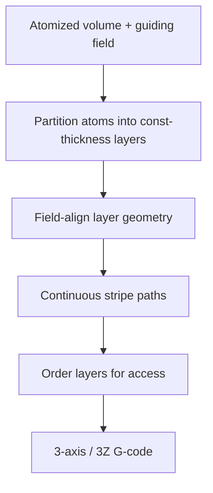

# #65 — AtomSlicer (2026)

- **Family:** A
- **Link:** doi.org/10.1145/3811363
- **Source:** compendium `paper-01.pdf` / `held-papers.json`

## When to use (adaptive slicer product)
- Dense, continuous, field-aligned fill on 3-axis or triple-Z-class machines.
- Prefer constant-thickness layers built from atoms over ad-hoc height fields.
- Product wants open reference code (`github.com/iota97/AtomSlicer`).

## Core idea (one sentence)
Atoms partitioned into constant-thickness, field-aligned layers with continuous stripe paths. Code: github.com/iota97/AtomSlicer

## Algorithm (plain steps)
1. Start from an atomized volume representation (atom frames from the Atomizer lineage).
2. Partition atoms into layers of constant thickness aligned to a guiding field.
3. Within each layer, extract continuous stripe toolpaths (stripe / phasor-style traces).
4. Order layers for 3-axis (or 3Z) deposition under printable slope/access limits.
5. Emit G-code (reference code targets 3-axis and 3Z 5-axis-style output).

## Constraints / what to expect
- Constant-thickness band must be respected; field alignment quality drives strength/surface.
- Stripe continuity helps reduce travels but depends on field singularities (Part G: stripe root Knöppel et al. 2015).
- Clearance cone still limits 3-axis poses; 3Z extends tilt budget (#56).
- Implementation complexity higher than Song ZAA.

## Data in
- Mesh/volume; atomization parameters; guiding orientation/scalar field; thickness band; machine mode (3-axis vs 3Z).

## Data out
- Ordered constant-thickness layers; continuous stripe polylines; 3-axis or 3Z G-code.

## Argument → proof sketch → conclusion
**Argument.** When skins and single height fields underserve dense fill quality, the slicer needs field-aligned constant-thickness layers that still run on Cartesian / triple-Z hardware.
**Proof sketch.** Part A (#65): atoms → constant-thickness field-aligned layers + continuous stripes; approach cards and decision map place AtomSlicer in Family A dense-fill slot, with public code. Part G corrects stripe attribution to Knöppel 2015 root.
**Conclusion.** Ship AtomSlicer as the advanced Family-A fill path after Atomizer (#67) framing; fall back to QuickCurve/CurviSlicer for simpler tops; escalate to B for true multi-axis iso-surfaces.

## Chaining
- Before: Atomizer (#67) atom frames / support-access ordering ideas; geometry-central stripes.
- After: 3-axis or Triple-Z (#56) execution; optional E fiber only if field matches fiber goals.
- Do not chain with: Song vertex-snap (#7) rewriting stripe Z; duplicate stripe stacks from unrelated phasor codes without a single field.

## Notes / inventory flags
- Code: github.com/iota97/AtomSlicer.
- Part G: registry attributes stripe step to Lichtenberg 2018; root method is Knöppel et al. 2015.
- DOI 10.1145/3811363.
