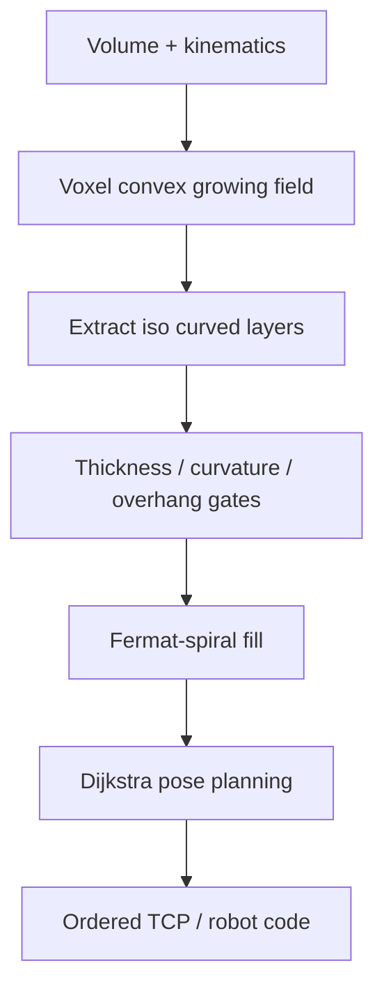

# #66 — Support-Free Volume Printing (Dai 2018)

- **Family:** B
- **Link:** doi.org/10.1145/3197517.3201342
- **Source:** compendium `paper-01.pdf` / `held-papers.json`

## When to use (adaptive slicer product)
- Robot or 5-axis cell must print a solid volume without sacrificial supports.
- Part overhangs defeat planar-layer budgets; hardware can tilt the nozzle continuously.
- You want a classical (non-neural) growing-field pipeline with continuous Fermat-spiral fill and explicit pose planning.
- Escalation from family A after the Ahlers clearance-cone check fails (decision map: support-free volume on robot/5-axis).
- Prefer this over geodesic tet pipelines when a voxel convex-front growth model matches the manufacturing cell.
- Good first B baseline for product demos of “print the whole volume support-free.”

## Core idea (one sentence)
Grow a voxel scalar field as a convex front whose iso-surfaces become support-free curved layers, fill each with Fermat spirals, then Dijkstra-plan nozzle poses.

## Algorithm (plain steps)
1. Voxelize the printable volume; initialize a seed region that rests on the bed or fixture.
2. Advance a convex growing front through the voxels so each new front stays self-supporting under the local nozzle tilt.
3. Extract successive iso-surfaces of the growing field as curved layers; enforce a printable thickness band.
4. Clamp or reject fronts that violate bounded curvature or local overhang (Part F gates).
5. Fill each layer with Fermat-spiral toolpaths (continuous sparse/solid fill; related to Zhao connected Fermat spirals, Part B).
6. Build a pose graph of candidate nozzle orientations per segment; plan transitions with Dijkstra under collision costs (part, fixture, gantry).
7. Write the Part F per-point record (XYZ, tool vector, local h/w, flow, speed, feature, sequence) and emit TCP for family D IK / robot post-processing.

## Constraints / what to expect
- Requires multi-axis kinematics; not for stock Cartesian-only printers.
- Part F multi-axis gates: thickness band, bounded curvature, local overhang, smooth orientation field, collision-free global order.
- Growing front is convex — deep tunnels / re-entrant topology may need Reeb-aware siblings (#68, INF-3DP #18) instead.
- Dense spiral polylines can starve firmware look-ahead; prefer TCP + timed post (TOPP-RA-class) over raw dense G1.
- Residual local overhangs after growth → try tool-vector rotation, then #51 tree supports.
- Extrusion must follow nozzle-tip speed relative to the part, not axis speed (Part F).

## Data in
- Solid volume (mesh → voxels); bed/fixture model; robot or 5-axis clearance model; layer-height / thickness band; max curvature / overhang angle.

## Data out
- Ordered curved layers + Fermat-spiral polylines; per-point tool vectors and sequence indices; TCP / robot language ready for family D.

## Argument → proof sketch → conclusion
**Argument.** When the product goal is support-free volume on a multi-axis cell and you want a field whose growth itself encodes overhang safety, Dai is the classical anchor before geodesic or neural fields.
**Proof sketch.** The held core idea advances a voxel field as a convex front so each iso-layer is locally printable; Fermat spirals give continuous fill; Dijkstra pose planning closes the collision loop that pure planar A cannot. Booklet section 4.3 lists Dai alongside geodesic and S3 for support-free robot/5-axis work; decision map routes “support-free volume” to FieldB starting with Dai #66.
**Conclusion.** Prefer #66 as the first B pipeline for solid support-free volumes; escalate to #16/#69 for geodesic tet fields, #68/#18 for tunnel topology, or #42/#45/#29 when strength/surface multi-objectives dominate.

## Chaining
- Before: optional G self-support TO (#48/#47/#50) to shrink overhang volume; FEA not required for the growing field itself.
- After: D singularity-aware / FRIK / env-aware (#49/#64/#63) for reachable joint motion; optional E fiber on layers if a fiber head is present; #51 if residual overhang remains.
- Do not chain with: pure 3-axis family A when hardware is Cartesian-only (cone check already failed or never applicable).

## Notes / inventory flags
- Classical 2018 SIGGRAPH B baseline; no dedicated public repo listed in Part D (unlike S3_DeformFDM / ReinforcedFDM).
- Fermat-spiral fill relates to Zhao et al. 2016 Connected Fermat Spirals (Part B citation).
