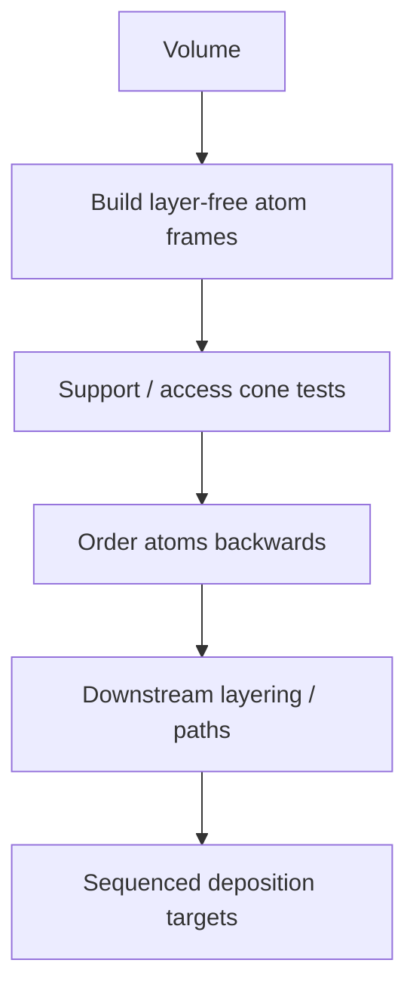

# #67 — Atomizer (2025)

- **Family:** A
- **Link:** doi.org/10.1111/cgf.70189
- **Source:** compendium `paper-01.pdf` / `held-papers.json`

## When to use (adaptive slicer product)
- Layer-free planning first: break the volume into atom frames before committing to layers.
- Need ordering under support and access cones on mildly non-planar / 3-axis-compatible hardware.
- Upstream of AtomSlicer (#65) in the product pipeline.

## Core idea (one sentence)
Layer-free atom frames ordered backwards under support/access cones.

## Algorithm (plain steps)
1. Discretize the printable volume into atom frames (local deposition elements).
2. Evaluate support and access cones per atom (what must exist below; what the nozzle can reach).
3. Order atoms backwards (from final surface toward base) so each atom’s support/access constraints are satisfied.
4. Hand the ordered atoms to a layer-forming / path stage (e.g. AtomSlicer) or deposit in atom order if the machine allows.
5. Emit sequenced deposition targets for downstream pathing.

## Constraints / what to expect
- Layer-free mid-representation — not by itself a full G-code skin algorithm.
- Access/support cones encode 3-axis (or limited-tilt) reachability; violations require hardware escalate.
- Ordering quality depends on atom size vs feature scale.
- Dense atom sets need efficient sequencing.

## Data in
- Volume/mesh; atom size; support cone and nozzle access cone parameters.

## Data out
- Ordered atom frames with local frames/poses; input to AtomSlicer-style layer partition.

## Argument → proof sketch → conclusion
**Argument.** Rigid planar layers fight geometry; product needs a printable ordering primitive before locking thickness.
**Proof sketch.** Part A (#67): layer-free atoms ordered backwards under support/access cones — precursor called out in approach cards (“Atomizer → AtomSlicer”). Stays Family A when cones match Cartesian/triple-Z reach.
**Conclusion.** Use Atomizer as the sequencing front-end; partition with AtomSlicer (#65) for constant-thickness stripe layers; escalate to B if access cones fail globally.

## Chaining
- Before: volume voxelization / framing; optional G self-support TO only if redesigning geometry.
- After: AtomSlicer (#65) partition + stripes; Triple-Z (#56) if tilt helps access.
- Do not chain with: planar-only Song (#7) as the layer model for the same atoms; CurviSlicer warp competing as a second volume deformation.

## Notes / inventory flags
- CGF doi.org/10.1111/cgf.70189.
- Booklet/domain notes: ancestor relationship to AtomSlicer; related mfx-inria lineage mentioned in Part B/C notes.
