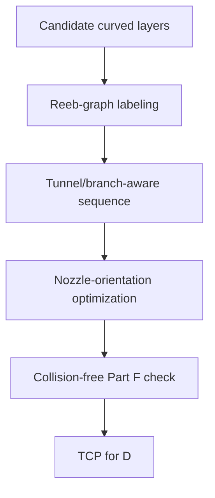

# #68 — Topological awareness, collision-free curved layers (2024)

- **Family:** B
- **Link:** doi.org/10.1016/j.addma.2024.104247
- **Source:** compendium `paper-01.pdf` / `held-papers.json`

## When to use (adaptive slicer product)
- Curved layers already exist (geodesic / deformation / neural) but tunnels and branches break naive bottom-up order.
- Product must label which layers belong to which tunnel/branch and optimize nozzle orientation for access.
- Collision-free global order Part F gate is failing under skeleton-tree alone (#16) or undeformed S3 order (#45).
- Pair with INF-3DP #18 when neural Reeb sequencing is desired; use #68 for classical Reeb-on-layers.
- Booklet checklist: “Later layer blocks nozzle → Reeb/skeleton reorder (#68/#16).”
- Prefer as a reusable post-pass module over any B field extractor.

## Core idea (one sentence)
Label tunnel/branch curved layers with a Reeb graph, then optimize nozzle orientations for collision-free multi-axis deposition.

## Algorithm (plain steps)
1. Obtain a stack of candidate curved layers from any B field (geodesic, stress, deformation, neural).
2. Build a Reeb graph on the layer / height function to detect tunnels, branches, and merges.
3. Label layers by Reeb nodes/edges so printable connected components are explicit.
4. Sequence components so the nozzle can exit cavities before closing them.
5. Optimize nozzle orientations per segment under clearance constraints (part, fixture, gantry).
6. Smooth the orientation field; re-check Part F gates; emit TCP for family D.
7. If local overhang still fails after orientation optimization, hand residual regions to #51.

## Constraints / what to expect
- Does not invent the layer field — assumes upstream B layers; focuses on topology + orientation.
- Part F: especially collision-free global order and smooth orientation field.
- Extreme topology may still need residual #51 tree supports where local overhang remains.
- Multi-axis kinematics required.
- Reeb construction quality depends on a clean scalar / layer indexing; noisy neural iso-layers may need smoothing first.

## Data in
- Ordered or unordered curved layers; tool clearance model; optional upstream field metadata.

## Data out
- Reeb-labeled layer groups; collision-aware sequence; optimized tool vectors; TCP for D.

## Argument → proof sketch → conclusion
**Argument.** #68 is the B topology specialist: when fields are fine but tunnels/branches make the print order unsafe, Reeb labeling + orientation optimization is the product fix.
**Proof sketch.** Held core idea: Reeb-graph labeling of tunnel/branch layers, then nozzle-orientation optimization. Approach card B when-to-use calls out tunnel/branch topology needing Reeb-aware ordering (#68, INF-3DP). Booklet checklist: “Later layer blocks nozzle → Reeb/skeleton reorder (#68/#16).”
**Conclusion.** Insert #68 after any B field extractor when global order fails; prefer #16 if skeleton-tree on tet geodesics is enough; prefer #18 if neural guidance+motion+Reeb should be joint.

## Chaining
- Before: any B field paper (#66/#69/#16/#42/#45/#29/#20) producing curved layers; optional G TO.
- After: D singularity / FRIK / env-aware (#49/#64/#63); optional E fiber; optional #51 supports on remaining overhangs.
- Do not chain with: pure 3-axis A on Cartesian-only hardware.

## Notes / inventory flags
- Additive Manufacturing journal DOI 10.1016/j.addma.2024.104247; no Part D code repo listed.
