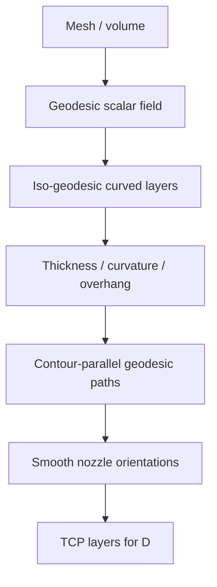

# #69 — Curved Layer Process Planning (Xu 2019)

- **Family:** B
- **Link:** doi.org/10.1016/j.cad.2019.05.007
- **Source:** compendium `paper-01.pdf` / `held-papers.json`

## When to use (adaptive slicer product)
- Multi-axis (robot / 5-axis) job needs curved layers that follow surface geodesics rather than a voxel growth front.
- Contour-parallel fill on curved layers is preferred over Fermat spirals or lattice tours.
- Part geometry is smooth enough that a single geodesic scalar field yields printable iso-layers.
- Product path: support-free or reduced-support freeform skins/volumes after family A cone check fails.
- Prefer when the manufacturing team already uses geometry-central / geodesic tooling and wants CAD-journal-classical process planning.
- Good fit for organic freeform shells where iso-geodesics track the design surface naturally.

## Core idea (one sentence)
Build a geodesic scalar field on the volume/surface, take iso-surfaces as curved layers, and fill them with contour-parallel geodesic paths.

## Algorithm (plain steps)
1. Discretize the part (surface mesh or volume) and compute a geodesic distance / geodesic field from a seed region or boundary.
2. Extract iso-geodesic surfaces as candidate curved layers within a thickness band.
3. Reject or smooth layers that violate bounded curvature or local overhang (Part F).
4. On each layer, generate contour-parallel geodesic toolpaths (offset along in-surface geodesics).
5. Join leftover islands or narrow leftovers where contour-parallel leaves gaps (plan continuous extrusion or accepted travels).
6. Assign nozzle orientations consistent with the local layer normal / geodesic gradient; smooth the orientation field.
7. Sequence layers for access; hand TCP paths to family D for collision-aware IK.

## Constraints / what to expect
- Multi-axis hardware required; Part F gates apply (thickness band, bounded curvature, local overhang, smooth orientation, collision-free order).
- Contour-parallel geodesics can leave thin leftover regions — plan joining or spiralization if continuous extrusion is mandatory.
- Deep branches/tunnels may need Reeb labeling (#68) or skeleton-tree sequencing (#16) beyond plain geodesic iso-order.
- geometry-central (flip geodesics / vector heat) is the Part D software anchor for geodesic primitives.
- Varying local thickness after projection ⇒ per-segment E rescale (Part F).

## Data in
- Mesh or tet volume; seed / boundary for geodesic field; thickness band; max curvature / overhang; kinematic clearance model.

## Data out
- Ordered curved layers; contour-parallel geodesic polylines; tool vectors; TCP for D.

## Argument → proof sketch → conclusion
**Argument.** Xu wins when the product wants geodesic-aligned layers and contour-parallel fill without committing to heat-method tet machinery (#16) or multi-objective deformation (#45/#29).
**Proof sketch.** Held core idea: geodesic-field curved layers + contour-parallel geodesic paths. Approach card B lists Xu with #16/#26 as the geodesic branch of family B; booklet 4.3 groups geodesic methods for support-free robot/5-axis volumes; decision map FieldB names geodesic #16/#69/#26.
**Conclusion.** Use #69 for geodesic contour-parallel curved-layer planning; prefer #16 when tet heat-method + skeleton-tree collision sequencing is needed; prefer #26 when the goal is a self-supporting lattice Euler tour.

## Chaining
- Before: G TO (#48/#47) or mesh repair (F #58); optional FEA only if later handing to E.
- After: E fiber along geodesic paths (#10/#15/#52); D motion/IK (#49/#64/#63); #68 if tunnel order fails; #51 for residual overhang.
- Do not chain with: pure 3-axis A on Cartesian-only hardware.

## Notes / inventory flags
- CAD journal 2019; no dedicated Part D code repo — reuse geometry-central geodesic tools.
