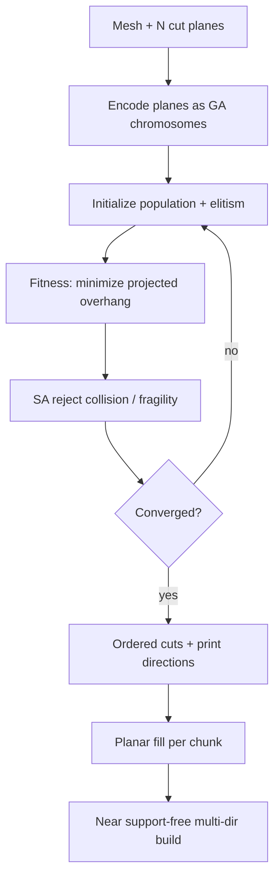

# #70 — Near support-free multi-directional printing (2019)

- **Family:** C
- **Link:** doi.org/10.1016/j.gmod.2019.101034
- **Source:** compendium `paper-01.pdf` / `held-papers.json`

## When to use (adaptive slicer product)
Use when RoboFDM-style multi-directional printing is desired but cutting planes and fabrication order must be optimized automatically for near-minimal overhang area. Prefer this over a full curved field (B) when hardware is indexed multi-directional (rotating platform / unsynchronized rotations) and the product can accept a few residual local supports.

## Core idea (one sentence)
A genetic algorithm plus simulated annealing globally optimize cutting-plane parameters and print order to minimize projected overhang area for multi-directional fabrication.

## Algorithm (plain steps)
1. User specifies the number of cutting planes \(N\) from model complexity.
2. Encode each candidate as plane parameters: a point \(p=(a,b,c)\) plus two rotational angles \(\alpha,\beta\), and which branch the plane cuts (binary chromosome).
3. Initialize a GA population (typical setting from sources: \(N_{pop}=200\)) with elitism and adaptive crossover/mutation rates.
4. Fitness = negative total projected overhang area (plus small penalties for residual support cylinders at local minima, e.g. radius ~1 mm in the paper’s formulation).
5. Simulated annealing rejects individuals that violate collision-free or fragility constraints, improving convergence under hard manufacturing constraints.
6. Iterate until a termination threshold (e.g. \(N_{term}=100\) generations) or fitness plateau; keep the elitist best.
7. Emit the ordered sequence of clipping planes → sub-volumes with print directions; planar-slice each chunk; optionally generate sparse residual supports where overhangs remain.

## Constraints / what to expect
- “Near” support-free: residual local supports may remain; fitness explicitly accounts for them.
- User-chosen \(N\) trades seam count vs. overhang reduction.
- Indexed multi-directional hardware (Cartesian or angular motion systems in related work); not simultaneous 5-axis freeform.
- Seams at every cut; plan bonding / continuous transitions.
- GA/SA runtime grows with \(N\) and mesh complexity; treat as offline build-prep, not per-layer reactive slicing.

## Data in
- Mesh; user \(N\); overhang angle / self-support threshold; collision and fragility constraints; optional residual-support radius policy.

## Data out
- Globally optimized ordered cutting planes and per-chunk print directions; sub-bodies; planar toolpaths per direction; optional residual support cylinders/volume; multi-directional G-code or robot sequence.

## Argument → proof sketch → conclusion
**Argument.** Exhaustive search over cutting-plane configurations is intractable; a probabilistic global search (GA) guided by a manufacturing-aware fitness, with SA enforcing hard constraints, yields near-optimal support reduction for multi-directional printing.
**Proof sketch.** (Inference from held sources / approach card C.) Elitist GA is probabilistically convergent; fitness directly encodes projected overhang (the quantity supports must cover); SA filters infeasible planes so surviving individuals remain collision-free and structurally sound; the best chromosome maps to a printable ordered decomposition compatible with indexed reorientation.
**Conclusion.** Optimized multi-directional cuts achieve near support-free builds on rotating/multi-directional hardware, bridging manual RoboFDM-style decomposition and productized adaptive slicing.

## Chaining
- Before: G self-support TO (#48/#47) to shrink the problem before cutting; F mesh hygiene / format choice.
- After: A planar fill inside each chunk; D for trajectories between indexed orientations; optional sparse F support generation only on residual overhangs.
- Do not chain with: B as a simultaneous full-volume field on the same solid (choose decomp *or* field); do not re-run GA cuts after A fill without updating the collision model.

## Notes / inventory flags
- Link present: `doi.org/10.1016/j.gmod.2019.101034` (Graphical Models / CVM 2019 lineage; preprint also discussed as global-optimal decomposition).
- Related lineage: beam-guided “General Support-Effective Decomposition” (Wu et al., TASE) is a sibling multi-directional method; this card sticks to the held GA+SA formulation for #70.
