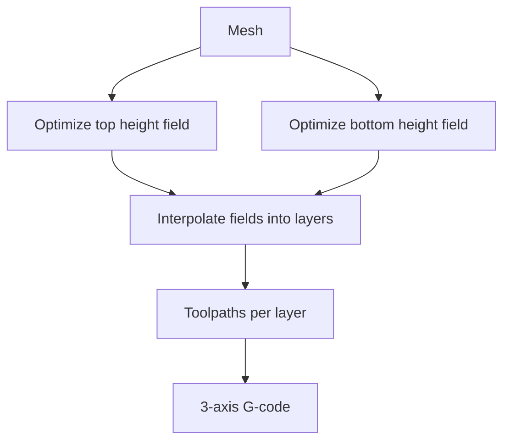

# #71 — Double QuickCurve (2025)

- **Family:** A
- **Link:** doi.org/10.2312/egs.20251052
- **Source:** compendium `paper-01.pdf` / `held-papers.json`

## When to use (adaptive slicer product)
- Both top and bottom surfaces should drive mild non-planar layers (not a single top height field).
- 3-axis or slope-clamped height-field workflow extending QuickCurve (#41).
- Interpolated intermediate layers between optimized top and bottom fields.

## Core idea (one sentence)
Optimized top and bottom height fields interpolated into layers.

## Algorithm (plain steps)
1. Fit/optimize a top height-field slicing surface (QuickCurve-style, with slope limits).
2. Fit/optimize a bottom height-field similarly.
3. Interpolate between top and bottom fields to form intermediate layer surfaces.
4. Generate toolpaths on each interpolated layer.
5. Emit ordered 3-axis G-code for the stack.

## Constraints / what to expect
- Height-field assumption on both sides; genus/overhangs that break height fields are out of scope.
- Interpolation must keep thickness within a printable band and slopes within clearance.
- Heavier optimize than single QuickCurve; still not full multi-axis iso-surfaces.
- Bottom non-planar may need bed adhesion strategy.

## Data in
- Mesh; slope clamps for top and bottom; layer count / thickness band; adhesion constraints.

## Data out
- Dual height fields; interpolated layer surfaces; 3-axis toolpaths/G-code.

## Argument → proof sketch → conclusion
**Argument.** Single-top QuickCurve leaves bottom stairsteps; users who care about both shells want coupled fields without jumping to robot slicers.
**Proof sketch.** Part A (#71): optimized top and bottom height fields interpolated into layers — decision map groups with #41 under mild whole-part curve. Family A cone/slope clamps still govern printability (Part F).
**Conclusion.** Upgrade path #41 → #71 when both boundaries matter; keep CurviSlicer (#13) as warp alternative; escalate to B if interpolated fields cannot meet thickness + collision.

## Chaining
- Before: QuickCurve (#41) as simpler single-field baseline; optional F planar for interior.
- After: 3-axis G-code; optional #32-style shell boolean if only boundary bands should be non-planar.
- Do not chain with: running #41 and #71 together as parallel top generators; AtomSlicer (#65) unless replacing height fields with atoms.

## Notes / inventory flags
- Eurographics short / doi.org/10.2312/egs.20251052.
- Direct sequel to QuickCurve (#41).
