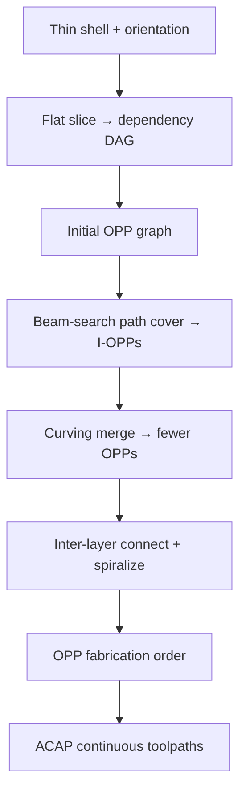

# #73 — ACAP (2023)

- **Family:** C
- **Link:** doi.org/10.1145/3575859
- **Source:** compendium `paper-01.pdf` / `held-papers.json`

## When to use (adaptive slicer product)
Use for thin shell / surface models (architectural skins, ceramic vessels, open shells) where transfer moves destroy surface quality and stability — especially viscous materials like clay. Prefer ACAP when you need as-continuous-as-possible deposition on 3-axis extrusion hardware via patch decomposition, optionally with curved layers, rather than multi-axis volume fields.

## Core idea (one sentence)
Decompose a thin shell into a minimal set of one-path patches (OPPs) that each admit a continuously depositable toolpath under flat and/or curved layers.

## Algorithm (plain steps)
1. Choose a feasible print orientation that satisfies the support-structure constraint (self-supporting or ground-based supports only).
2. Uniformly flat-slice the shell; build a dependency DAG whose nodes are segments/contours and edges encode print-before relations.
3. Collapse forced same-path nodes into an initial OPP graph; solve a precedence-constrained minimum path cover (beam search) to merge into fewest I-OPPs (flat-only).
4. Bottom-up merge OPPs further with a curving operation (modified CurviSlicer flat-term) under thickness and slope-angle (nozzle clearance) constraints → II/III-OPPs.
5. Insert collision-dependency edges when printed height would hit the nozzle carriage; forbid merges that create dependency deadlocks.
6. Rebuild smooth curved layers for final OPPs; connect inter-layer paths (zig-zag for segments, spiralization for contours); fill low-slope underfills with connected Fermat spirals.
7. Order OPPs by remaining dependencies; emit continuous per-OPP toolpaths plus safe travel between patches; post-optimize spacing/smoothness.

## Constraints / what to expect
- Targets single-bead-thick shells; solid volumes need a different pipeline.
- Slope/thickness bounds from nozzle geometry (ceramic vs FDM bands differ); steep regions force more OPPs.
- Global nozzle-length collisions increase OPP count (shorter nozzles → more patches).
- Seams remain between OPPs; viscous clay shows transfer-move artifacts if OPP count stays high.
- Supports, when needed, are pre-built and placed (decoupled), or the shell is manually split and assembled.
- Demonstrated on 3-axis DIW ceramic and FDM platforms (Zhong et al., TOG 2023).

## Data in
- Thin shell mesh (open or closed); print orientation; nozzle model (length, tip angle, width); layer thickness band \(t_{min}\)–\(t_{max}\); path width; material mode (ceramic/FDM).

## Data out
- Minimal OPP decomposition; per-OPP flat/curved layers and continuous polylines; OPP sequence + safe travels; G-code for 3-axis extrusion; optional pre-print support volumes.

## Argument → proof sketch → conclusion
**Argument.** Continuity of extrusion on shells is a precedence-constrained minimum path cover: fewer continuous patches mean fewer transfer moves, hence better surface quality, stability, and time — especially for high-inertia pastes.
**Proof sketch.** (From paper + held sources.) An OPP is a shell patch traversable in one path under fabrication constraints; flat merging solves PC-MPC via beam search on the dependency DAG; curving merges stackable OPPs when slope/thickness allow, strictly reducing patch count; collision edges preserve feasibility. Empirical TOG evaluation shows large reductions in disconnected paths vs Cura surface/spiralize mode and shorter print times on tested shells (use paper tables when citing numbers; do not invent).
**Conclusion.** ACAP turns shell continuity into a geometric decomposition product feature: minimize OPPs, then fill continuously, on stock 3-axis hardware.

## Chaining
- Before: F mesh repair / shell extraction; optional G for ribbed or thickened shells.
- After: E fiber along shell geodesics on each OPP; A-style mild curve already embedded via curving merge; escalate to D only if moving the same shells onto a robot.
- Do not chain with: B volumetric fields meant for solids; avoid C planar cutters (RoboFDM/#70) that re-partition a shell already OPP-optimized unless assembling multi-piece supports.

## Notes / inventory flags
- Link present: `doi.org/10.1145/3575859` (ACM TOG 42(3); also arXiv 2201.02374 “As-Continuous-As-Possible…”).
- Software context: uses CurviSlicer (#13, family A) as a subroutine inside the curving operation — cross-family dependency, not a family change for the card.
